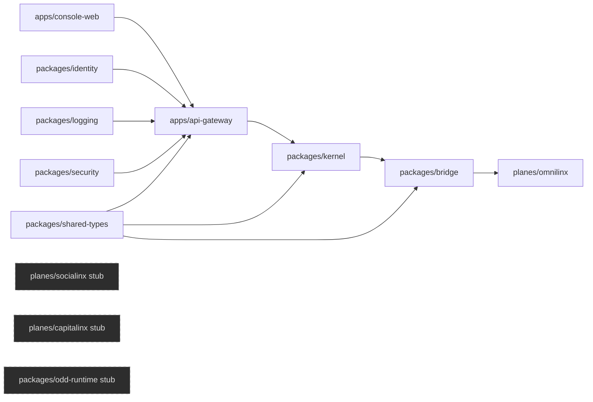

# EternaLynX Phase 1 Foundation Architecture

## Planar Isolation Rule
- `kernel` never calls plane internals directly; it only uses `bridge.execute(...)`.
- planes expose handlers registered into bridge; no plane-to-plane imports.
- `socialinx` and `capitalinx` remain non-operational stubs in this phase.

## Local-first identity + audit
- identity keys are generated and persisted locally at `./.local/identity.json`.
- audit events are hash-chained and appended to `./logs/audit.log`.
